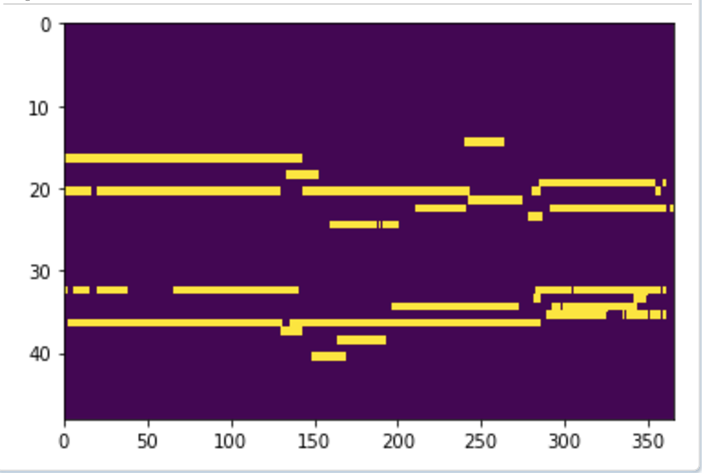
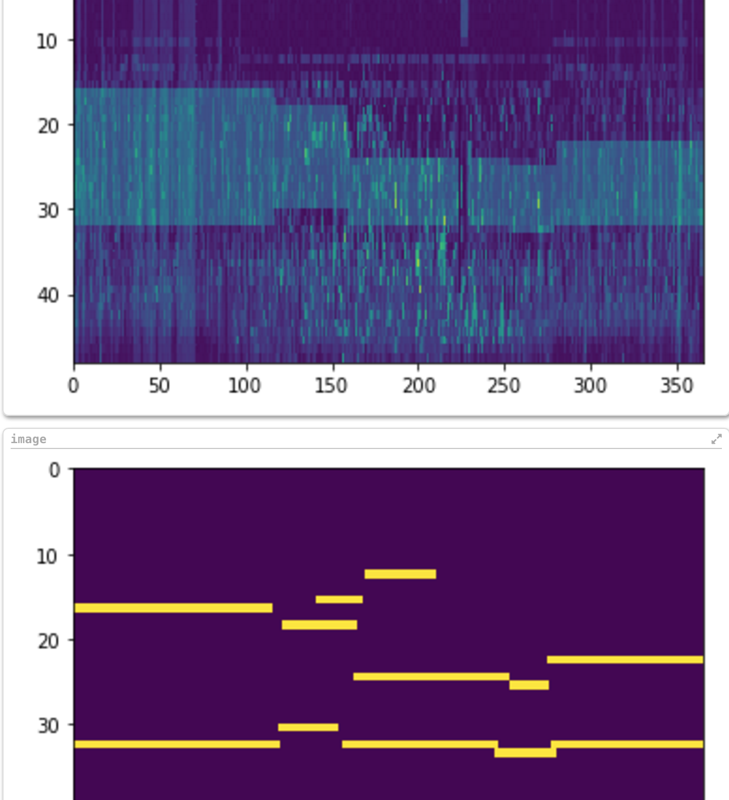
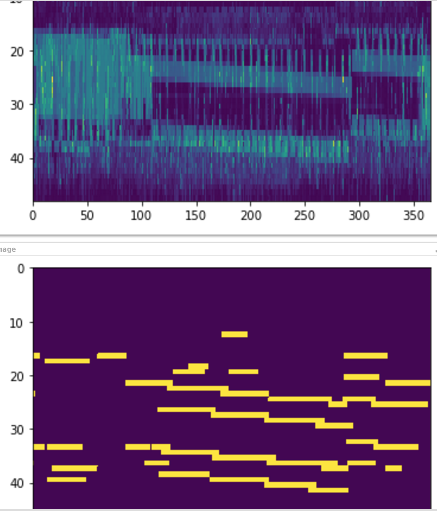

This will be the last week for Andrew Lachlan to be the supervisor of our research project. Mahsa Salehi will be our new supervisor starting from next week.

This week, we are focusing on working in linking edges and remove edges that have be detected mistakenly by the old algorithm. we have been trying different approaches:

Approach:
Extending edges that have been detected until the next pixel is considered as "not edge", while removing single pixels from each time slot.

It looks like this approach works pretty well. However, it will extends by mistake and make edges that did not exist. This is due to wrong implementations in code. 

In this approach, we still linked the edges. Instead of recreating original edges, we decide to reduce the area of median filtring in order to reduce the possibilty in removing possible edges from the original image.
Moreover, we have removed many small edges (with length 0 to 20) in order to remove useless informations that we do not considered as an edge. With this, we can now work on classifying the accuracy of the edges using machine learning later on.

More Examples:

Plans for next week:
Extract the indices of the edges so that we can apply them to our original data and apply these information to machine learning.
