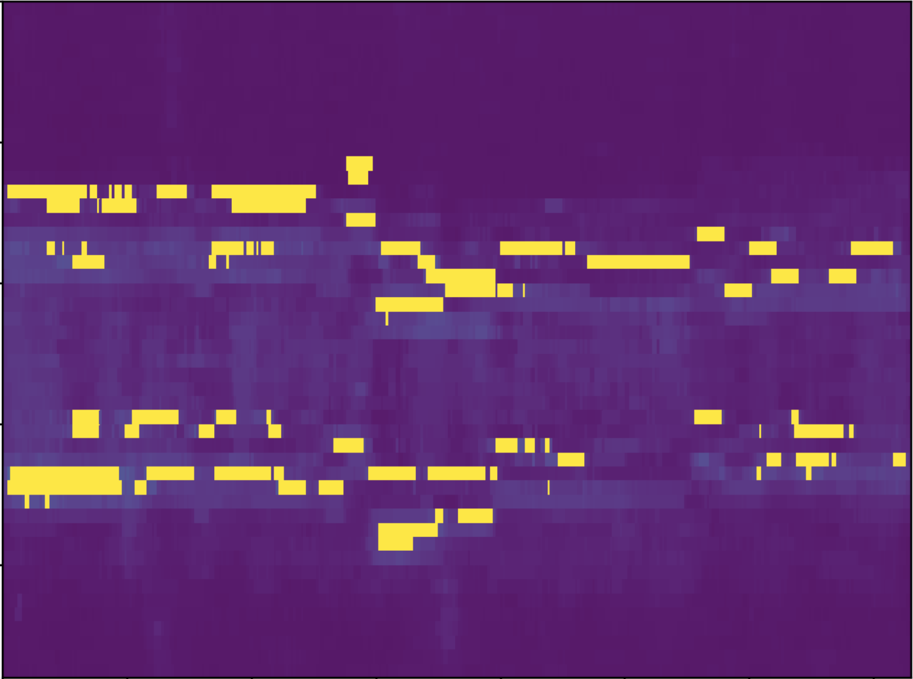

This week, we have been looking through machine learning in order to detect edges by machine.

The machine learning algorithm we chose was ARIMA (AutoRegressive Integrated Moving Average). It is a timeseries forecasting Machine Learning algorithm such that the algorithm will take previous values and predict the next value of the dataset. Moreover, the algorithm will take a moving average values and if the actual value and the predicted value have a high difference, the algorithm should mark it as an edge.

While we are implementing ARIMA, we took 60% of our data as training data and the others as test data. The algorithm will predict the values of our testing datasets and compare the values between the predicted values and the actual values. In order to make sure our prediction is accurate, the algorithm will check through the minimum mean squared error calculated by the predicted and actual values.

We tried through the ARIMA algorithm and it looks like the outcome is pretty good at the current stage.

For next week, we hope to find a better value for the ARIMA algorithm such that we can make the algorithm works better and will create a better output as our final goal.
